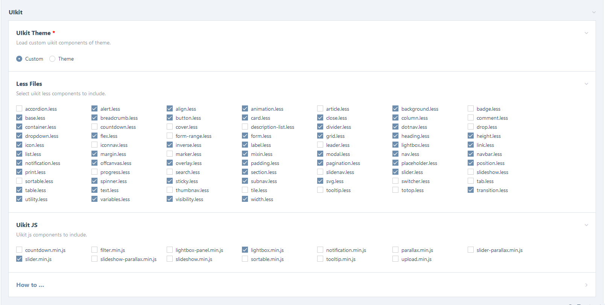

# FrontEndTools ProcessWire Module
This module provides some useful tools for frontend development:
- Less compiler
- SCSS compiler
- CSS minifier

## Less
```php
// Get the module instance
$FrontEndTools = $modules->get("FrontEndTools");

// Set less files array
$less_files = ["one.less","two.less"];

// Set less variables
$less_vars = ["global-primary-background" => "blue"];

// Set the options (optional)
$options = ["output_file" => "main", "cache_folder" => "less-cache"];

// Compile less files and get the cache or the compiled file url
$less = $FrontEndTools->less($less_files, $less_vars, $options);

// echo <link> tag in <head> section
echo "<link rel='stylesheet' type='text/css' href='$less'>";
```

## SCSS
```php
// Get the module instance
$FrontEndTools = $modules->get("FrontEndTools");

// directory name relative to the templates folder that contains all scss files
// module will watch this folder for changes and recompile the css file
$scss_dir = "scss/";

// main scss file
// only this file will be passed to the compiler, all other files have to be included in the mail file
$source_file_name = "main.scss";

// Output file name, will be generated in /site/asses/scss/
$output_file = "main-scss";

// Get compiled css file url
$scss = $FrontEndTools->scss($scss_dir, $source_file_name, $output_file_name);

// echo <link> tag in <head> section
echo "<link rel='stylesheet' type='text/css' href='$scss'>";
```

## Minify
```php
// Get the module instance
$FrontEndTools = $modules->get("FrontEndTools");

// css string
$css_string = "body { color: red; }";

// Minify
$minified_css = $FrontEndTools->minify($css_string);

// TODO file_put_contents();

```

## UIkit
Uikit framework is included in the module and you can use provided methods to quickly include uikit in your project. 
There is two options you can choose from:
- **Custom**. Choose which components you want to include, less and javascript.
- **Theme**. Use default uikit theme, everithing will be included.

Options you can use with `uikit_stylesheet()` and `uikit_compile()` methods
```php
/**
 * Pass additional less files to the compiler
 * specify full file paths in the array
 */
$files = [];

/**
 * Override LEss Variables
 * @example ['global-primary-background' => "blue"]
 */
$variables = [];

/**
 * Options
 * override default compiler options
 */
$options = ["output_file" => "main", "cache_folder" => "less-cache"];
```

Render uikit stylesheet, scripts and preload
```php
<?php
// Get the module instance
$FrontEndTools = $modules->get("FrontEndTools");
?>

<head>

  <?php
    // Render preload styles tags
    $FrontEndTools->uikit_preload();
  ?>

  <?php
    // Render styles tags
    $FrontEndTools->uikit_stylesheet($files = [], $variables = [], $options = []);
  ?>
	
  <?php
    // Render scripts tags
    $FrontEndTools->uikit_scripts();
  ?>

</head>
```

If you only need to compile uikit, and do the rest manually, you can use `uikit_compile()` method:
```php
// Get the module instance
$FrontEndTools = $modules->get("FrontEndTools");

// Compile and get file url
$src = $FrontEndTools->uikit_compile($files = [], $variables = [], $options = []);
```



